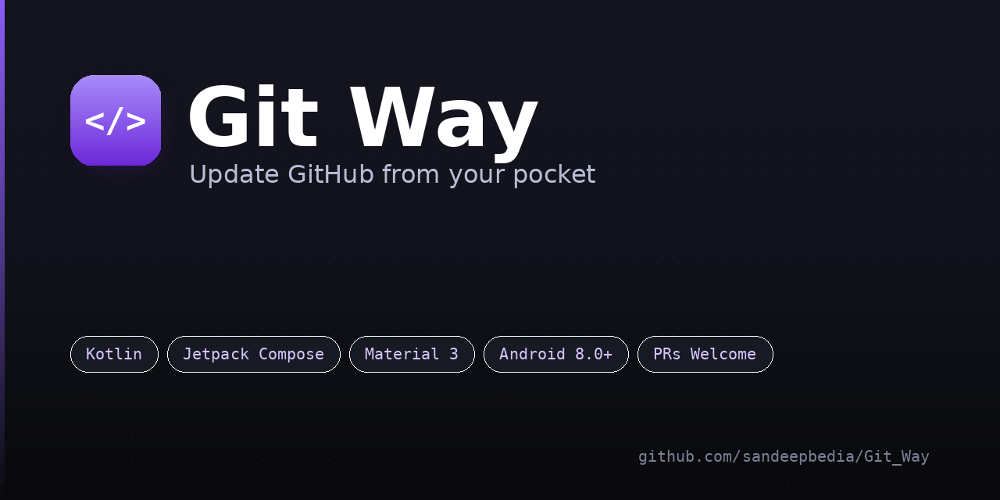
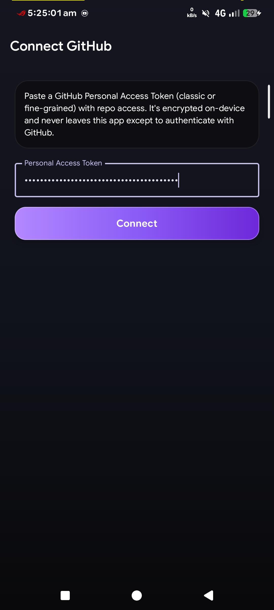
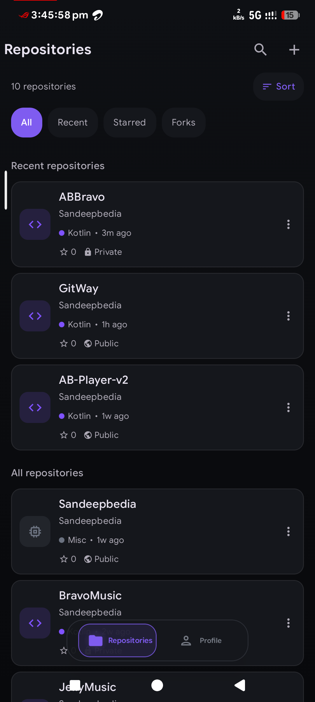
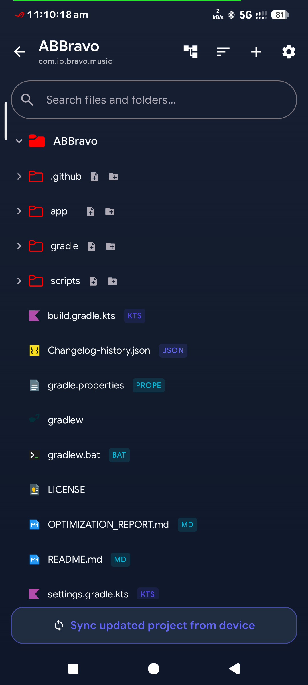
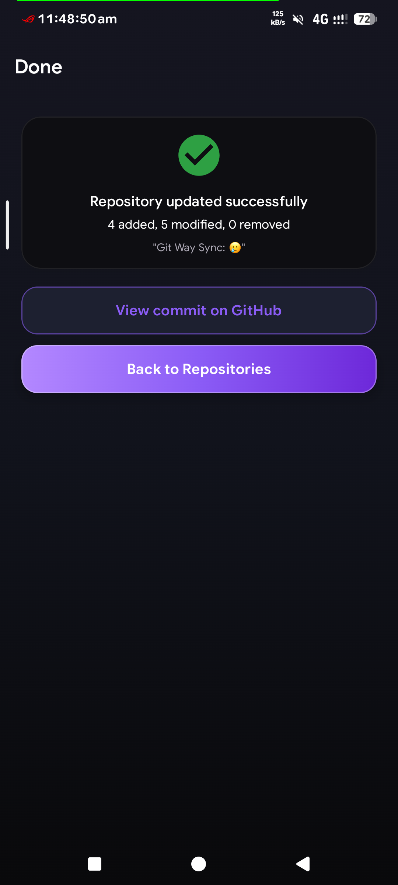

<div align="center">



# Git Way

**Push local Android projects straight to GitHub — from your phone, no laptop required.**

[](https://kotlinlang.org)
[](https://developer.android.com/jetpack/compose)
[-171923?style=flat-square)](#)
[](https://github.com/Sandeepbedia/GitWay/actions/workflows/build-check.yml)
[](https://github.com/Sandeepbedia/GitWay/releases/latest)
[](LICENSE)
[](CONTRIBUTING.md)

</div>

---

Git Way turns your phone into a real GitHub push client. Point it at a project
folder, it compares that folder against a repository's actual Git tree (real blob
SHA hashing, not just filenames), shows you exactly what changed, and pushes a
single atomic commit — all from the Storage Access Framework, no `git` binary and
no laptop involved.

## Table of contents

- [Features](#features)
- [Screenshots](#screenshots)
- [Tech stack](#tech-stack)
- [Project structure](#project-structure)
- [How a push actually works](#how-a-push-actually-works)
- [Getting started](#getting-started)
- [Contributing](#contributing)
- [License](#license)

## Features

**Compare & push**
- Real diff engine — hashes local files as Git blobs and compares against the
  repository's live tree, so Added / Modified / Removed is always accurate, not
  guessed from timestamps.
- Repository-scaffolding files (`README.md`, `LICENSE`, `.gitignore`, `.github/`
  workflows, `.gitkeep`, Play Store `screenshots/`, etc.) are automatically excluded
  from "Removed" detection — pushing from your phone never threatens to delete files
  GitHub itself owns. Anything else can be marked "don't track" per-file, permanently.
- Manual file selection before every push — select all, clear, or pick files one by
  one per Added/Modified/Removed group.
- Atomic commits via GitHub's Git Data API (blob → tree → commit → ref update) — a
  push either lands completely or not at all, never a half-finished commit.
- Automatic retry with backoff on transient network errors (timeouts, 502/503/504);
  GitHub's *real* error message is parsed and shown — never just a bare `HTTP 422`.
- Live, granular progress: Validating → Uploading files → Creating tree → Creating
  commit → Updating branch → Verifying → Done, with a cancel button at every stage.

**Safety**
- **Smart Upload Protection** — scans every file before upload for secrets (API
  keys, tokens) and known-sensitive files (keystores, `.env`), and blocks or
  redacts them automatically.
- **Project/Repository Identity Match** — detects the Android `applicationId` from
  both the local folder and the remote repo before a push, and warns if they don't
  match, so you can't accidentally push one app's code into another app's repo.

**Everyday use**
- GitHub sign-in via a Personal Access Token only — no OAuth backend, nothing
  proxied through a third-party server.
- In-app **Repository Browser** — view a repo's remote file tree, open files with
  syntax highlighting, delete files/folders directly on GitHub.
- Repository list with search, sort (recent / A–Z), and per-language color coding.
- Light, Dark, and true-black AMOLED themes.

## Screenshots

<!--
  Don't edit this section by hand — it's auto-generated.
  Drop numbered images (1.png, 2.png, 3.png, ... as many as you like, any
  order) into docs/screenshots/, then run:
    python3 docs/generate_screenshots.py
  and this section will rebuild itself as a 2-column table.
-->
<!-- SCREENSHOTS:START -->
<table>
  <tr>
    <td width="50%"></td>
    <td width="50%"></td>
  </tr>
  <tr>
    <td width="50%"></td>
    <td width="50%"></td>
  </tr>
</table>
<!-- SCREENSHOTS:END -->

## Tech stack

| Layer | Choice |
|---|---|
| Language | Kotlin |
| UI | Jetpack Compose + Material 3 (custom "Liquid Glass" design system) |
| Architecture | MVVM (`ui` → `domain` → `data`), manual DI (no Hilt/Koin) |
| Networking | Retrofit + kotlinx.serialization, GitHub REST + Git Data API |
| Async | Kotlin Coroutines |
| Local storage | Storage Access Framework (project files), AndroidX Security /
  EncryptedSharedPreferences (GitHub token) |
| Min SDK | 26 (Android 8.0) |

## Project structure

```
Git_Way/
├── app/
│   └── src/main/
│       ├── kotlin/com/io/git/way/
│       │   ├── AppContainer.kt          # Manual DI container
│       │   ├── GitWayApp.kt             # Application class
│       │   ├── MainActivity.kt          # Single-activity host
│       │   │
│       │   ├── data/
│       │   │   ├── local/               # On-device logic — no network
│       │   │   │   ├── FolderScanner.kt          # SAF folder walk → LocalFile list
│       │   │   │   ├── GitBlobHasher.kt          # Real Git blob SHA-1 hashing
│       │   │   │   ├── PathNormalizer.kt         # Path cleanup before pushing
│       │   │   │   ├── SecretScanner.kt          # Smart Upload Protection: secrets
│       │   │   │   ├── KeystoreSanitizer.kt      # Smart Upload Protection: keystores
│       │   │   │   ├── ProtectionScanner.kt      # Orchestrates the scan above
│       │   │   │   ├── IgnoreEngine.kt           # .gitignore-style local filtering
│       │   │   │   ├── IgnoreListManager.kt      # User's manual "don't track" list
│       │   │   │   ├── AppIdentityDetector.kt    # applicationId match protection
│       │   │   │   ├── TokenManager.kt           # Encrypted PAT storage
│       │   │   │   └── NetworkUtils.kt           # Connectivity pre-check
│       │   │   │
│       │   │   ├── remote/
│       │   │   │   ├── GitHubApiService.kt       # Retrofit endpoints (REST + Git Data API)
│       │   │   │   ├── RetrofitProvider.kt       # Client/JSON setup
│       │   │   │   └── dto/GitHubDtos.kt         # Wire-format models
│       │   │   │
│       │   │   └── repository/
│       │   │       └── GitHubRepositoryImpl.kt   # Push pipeline, retries, error parsing
│       │   │
│       │   ├── domain/
│       │   │   ├── ComparisonEngine.kt           # Added/Modified/Removed diff logic
│       │   │   ├── RepositoryScaffoldFiles.kt    # Repo-only-file exclusion rules
│       │   │   ├── CommitMessageBuilder.kt
│       │   │   ├── model/                        # Plain Kotlin domain models
│       │   │   └── repository/GitHubRepository.kt # Interface the ViewModels depend on
│       │   │
│       │   ├── navigation/
│       │   │   ├── GitWayNavGraph.kt
│       │   │   └── Routes.kt
│       │   │
│       │   └── ui/
│       │       ├── common/               # Shared ViewModel, formatters, file-icon mapping
│       │       ├── theme/                # Color tokens, Type, Theme, "Liquid Glass" components
│       │       └── screens/
│       │           ├── splash/
│       │           ├── auth/             # Token entry
│       │           ├── overview/
│       │           ├── repos/            # Repository list
│       │           ├── browser/          # In-app remote file browser
│       │           ├── folder/           # Local folder picker
│       │           ├── analysis/         # Compare / select files to push
│       │           ├── confirm/          # Final push confirmation
│       │           ├── upload/           # Live push progress
│       │           ├── complete/         # Success screen
│       │           └── profile/
│       │
│       ├── res/                          # Standard Android resources
│       └── AndroidManifest.xml
│
├── .github/
│   └── workflows/
│       ├── release.yml                   # Tag push -> build APK -> publish GitHub Release
│       └── build-check.yml               # Compile check on every push/PR
│
├── docs/
│   ├── banner.png                        # This README's banner
│   ├── generate_screenshots.py           # Rebuilds the Screenshots section above
│   ├── RELEASING.md                      # How to cut a new release
│   └── screenshots/                      # Drop 1.png, 2.png, 3.png, ... here
│
├── gradle/                               # Version catalog + wrapper
├── build.gradle.kts
├── settings.gradle.kts
├── keystore.properties.example           # Copy to keystore.properties for release builds
├── LICENSE
├── CONTRIBUTING.md
└── README.md
```

## How a push actually works

1. **Scan** — the selected local folder is walked via the Storage Access
   Framework; every file is run through Smart Upload Protection (secret scanning,
   keystore detection) before anything else touches it.
2. **Identity check** — the app's `applicationId` is read from both the local
   project and the target repository's remote tree; a mismatch blocks the push.
3. **Compare** — every local file is hashed the same way Git hashes a blob and
   compared against the repository's current tree via the Git Data API. Repo
   scaffolding (README, `.github/`, etc.) never shows up as "Removed".
4. **Select** — you pick exactly which Added/Modified/Removed files to include.
5. **Push** — blobs are created for changed files, a new tree is built on top of
   the current `base_tree`, a commit is created, and the branch ref is updated —
   in that order, atomically. Any transient failure (timeout, 5xx) retries
   automatically; anything else (permissions, invalid tree, etc.) shows GitHub's
   real error text.
6. **Verify** — after the push, the branch ref is re-fetched to confirm it now
   points at the new commit before the app reports success.

## Getting started

```bash
git clone https://github.com/Sandeepbedia/GitWay.git
cd GitWay
cp keystore.properties.example keystore.properties
```

Open the project in Android Studio, let Gradle sync, and run the `app`
configuration on a device or emulator (API 26+). No backend, API keys, or `.env`
setup needed — Git Way talks to `api.github.com` directly using a GitHub
[Personal Access Token](https://github.com/settings/tokens) you paste in at
runtime.

### Token scopes

Create a classic token with these three scopes (the Connect screen validates and
flags any that are missing):

| Scope          | Needed for                                             |
|----------------|--------------------------------------------------------|
| `repo`         | Read/write all repositories (contents, PRs, issues, releases) |
| `workflow`     | Updating `.github/workflows` files and triggering runs  |
| `delete_repo`  | Deleting repositories (Profile → Repo settings)        |

A fine-grained token works too, but GitHub doesn't report its permissions via
the API — grant the equivalent repository permissions (contents read/write,
workflows, and delete) and the app will proceed with a "couldn't verify scopes"
warning.

## Releases & updates

Tagged pushes (`v1.0`, `v1.1`, ...) are built and published automatically by
[`.github/workflows/release.yml`](.github/workflows/release.yml) — see
[`docs/RELEASING.md`](docs/RELEASING.md) for the full process. The app itself
checks the [latest release](https://github.com/Sandeepbedia/GitWay/releases/latest)
on launch and shows an in-app **Update available** dialog when a newer version has
been published — no manual "check for updates" needed.

## Contributing

Contributions are genuinely welcome — bug fixes, small features, docs, and UI
polish. Please read **[CONTRIBUTING.md](CONTRIBUTING.md)** first; it covers dev
setup, code conventions, and the Pull Request checklist. Please open an issue
before starting on anything larger than a small fix, so scope can be agreed on
before you invest time.

## License

Git Way is released under a **custom source-available license** — see
**[LICENSE](LICENSE)** for the full text. The short version:

- ✅ You can read the code, fork it, build it for yourself, and send Pull Requests.
- ❌ You can't publish this app (or a modified/rebranded copy of it) to the Play
  Store, F-Droid, or any other distribution channel as your own.

If you want to redistribute it for some other reason, open an issue and ask.

---

<div align="center">
<sub>Built by <a href="https://github.com/sandeepbedia">Sandeep Bedia</a></sub>
</div>
